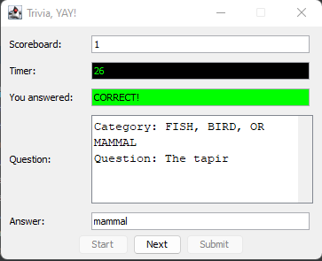
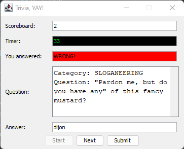
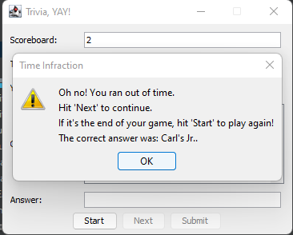
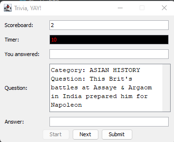

# Kenzie Java Project - Capstone

Foundations project completed after first 3 months of Kenzie Academy course.

The program is a jeopardy style game. It makes a call to an API provided by Kenzie
Academy to receive a list of clues. Clues contain questions and answers.

I used Swing for the GUI.

This project was my first experience calling on an API. It was also necessary to utilize
the FasterXML/jackson project for parsing JSON.

